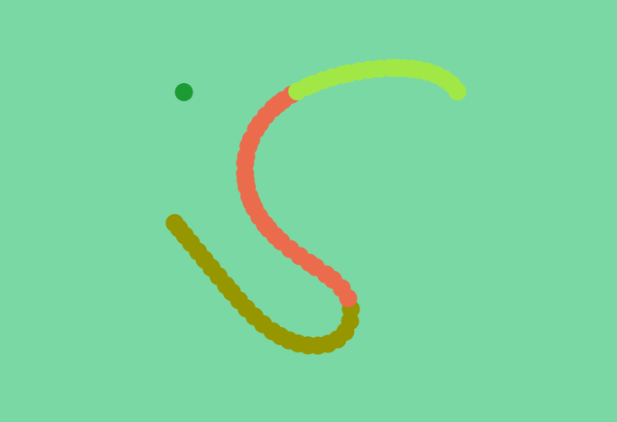

# Continuous Snake

## Description
A snake game in which the player can move in any direction instead of the classic 4 directions. Written in [Processing](https://processing.org/).



## Requirements
[Processing](https://processing.org)

## Quick start
### Windows
*(may work on Linux too but wasn't tested)*
```console
$ processing-java --sketch=<path_to_continuous-snake_directory> --run
```